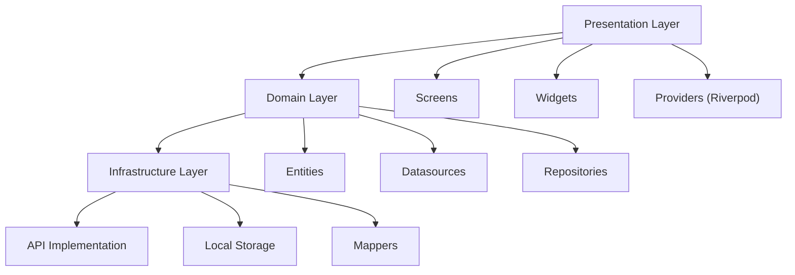
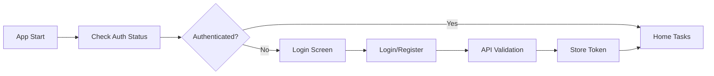
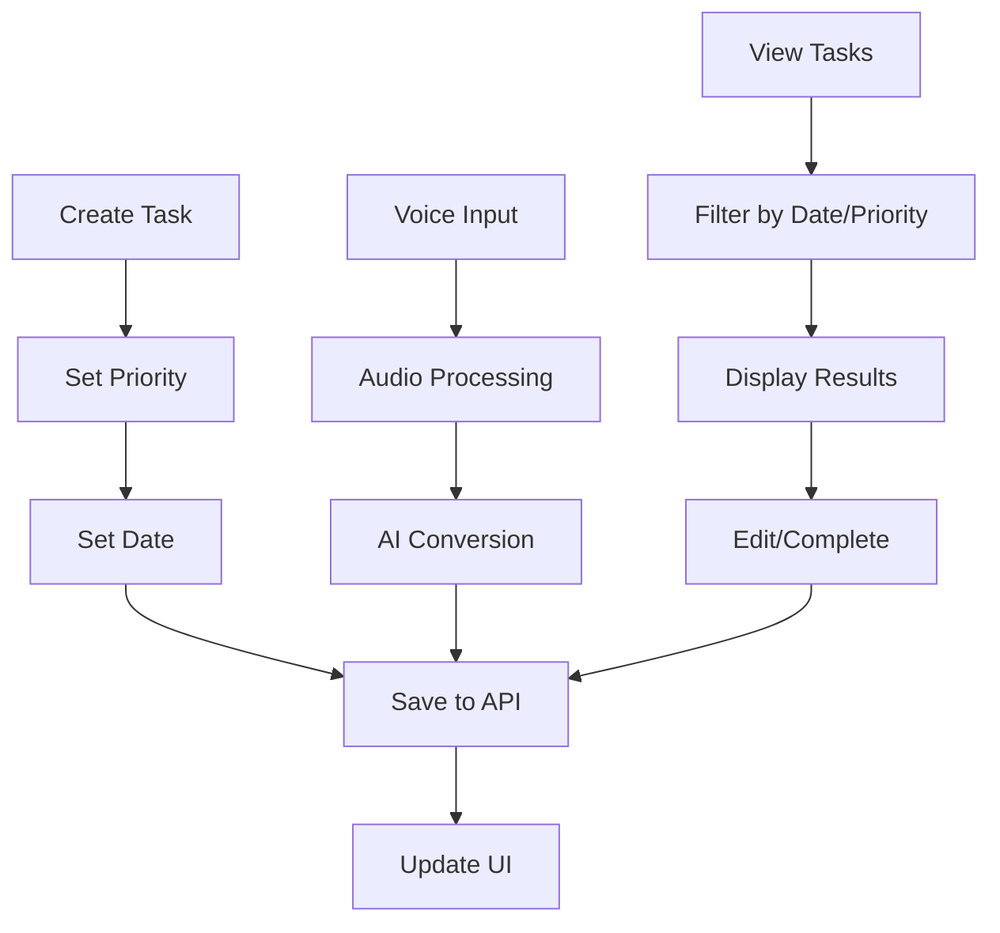

# ToDoAppMobile

A comprehensive Flutter-based task management application with advanced features including authentication, priority-based task organization, and audio-to-task conversion capabilities.

## 📱 Overview

ToDoAppMobile is a cross-platform mobile application built with Flutter that provides a complete task management solution. The app features a modern dark theme interface and supports multiple platforms including Android, iOS, Web, Windows, macOS, and Linux. [1](#0-0) 

## ✨ Key Features

### Authentication System
- **User Registration**: Complete user registration with email verification
- **Secure Login**: Username/password authentication with token-based security
- **Password Recovery**: Forgot password functionality with email verification
- **Session Management**: Automatic token refresh and secure storage [2](#0-1) 

### Task Management
- **Priority-Based Organization**: Tasks categorized by Low, Medium, High, and Urgent priorities
- **Date-Based Filtering**: View tasks by specific dates with various sorting options
- **Task Search**: Advanced search functionality for finding tasks
- **Audio-to-Task**: Convert voice recordings directly into tasks
- **Real-time Updates**: Live task status updates and modifications [3](#0-2) [4](#0-3) 

## 🏗️ Architecture

The application follows **Clean Architecture** principles with clear separation of concerns:



### State Management
The app uses **Riverpod** for state management, providing reactive and testable state solutions throughout the application. [5](#0-4) 

### Navigation
**GoRouter** handles navigation with authentication-aware routing and automatic redirects based on user authentication status. [6](#0-5) 

## 🛠️ Tech Stack

### Core Framework
- **Flutter SDK**: ^3.7.2
- **Dart**: Latest stable version

### Key Dependencies
- **State Management**: flutter_riverpod ^2.6.1
- **Navigation**: go_router ^16.0.0
- **HTTP Client**: dio ^5.8.0+1
- **Secure Storage**: flutter_secure_storage ^9.2.4
- **Form Validation**: formz ^0.8.0
- **Animations**: animate_do ^4.2.0, lottie ^3.3.1
- **Typography**: google_fonts ^6.2.1
- **Environment Variables**: flutter_dotenv ^5.2.1
- **Audio Recording**: record ^6.0.0 [7](#0-6) 

## 📁 Project Structure

```
lib/
├── auth/                    # Authentication module
│   ├── domain/             # Auth business logic
│   ├── presentation/       # Auth UI components
│   └── state/             # Auth state management
├── config/                 # App configuration
│   ├── router/            # Navigation setup
│   └── theme/             # App theming
├── domain/                 # Core business logic
│   ├── entities/          # Domain models
│   └── infrastructure/    # Data layer
├── presentation/           # Main UI components
│   ├── dialogs/           # App dialogs
│   ├── providers/         # State providers
│   ├── screens/           # App screens
│   ├── views/             # Reusable views
│   └── widgets/           # Custom widgets
├── shared/                 # Shared utilities
└── states/                # Global state
```

## 🎨 Design System

The app features a modern dark theme with consistent design patterns:

- **Primary Colors**: Dark background (#1E1E1F) with blue accents
- **Typography**: Montserrat Alternates font family
- **Task Priority Colors**: 
  - Low: Green
  - Medium: Yellow
  - High: Orange  
  - Urgent: Red [8](#0-7) 

## 🔐 Authentication Flow



The authentication system provides secure access with automatic token management and route protection. [9](#0-8) 

## 📋 Task Management Flow



## 🚀 Getting Started

### Prerequisites
- Flutter SDK (^3.7.2)
- Dart SDK
- Android Studio / VS Code
- iOS Development tools (for iOS deployment)

### Installation

1. **Clone the repository**
   ```bash
   git clone https://github.com/Juangmz7/ToDoAppMobile.git
   cd ToDoAppMobile
   ```

2. **Install dependencies**
   ```bash
   flutter pub get
   ```

3. **Environment Setup**
   Create a `.env` file in the root directory with your API configurations:
   ```
   AUTH_URL=your_auth_api_url
   TASK_URL=your_task_api_url
   ``` [10](#0-9) 

4. **Run the application**
   ```bash
   flutter run
   ```

## 🌐 API Integration

The app communicates with REST APIs for both authentication and task management:

### Authentication Endpoints
- `POST /login` - User authentication
- `POST /logout` - User logout  
- `POST /register` - User registration
- `POST /forgot-password` - Password recovery
- `GET /validate-reset-token` - Token validation
- `POST /change-password` - Password change [11](#0-10) 

### Task Management Endpoints
- `GET /by-priority` - Filter tasks by priority
- `GET /by-date` - Filter tasks by date
- `GET /by-date-order-by-priority-asc` - Sorted task retrieval
- `PUT /{id}` - Update task
- `POST /audio-gen` - Audio-to-task conversion
- `POST /` - Create new task
- `GET /search-by-similarities` - Search tasks [12](#0-11) 

## 🔧 Configuration

### Theme Customization
The app theme can be customized through the AppTheme class, supporting both light and dark modes with Material 3 design principles. [13](#0-12) 

### Route Configuration
Navigation routes are centrally managed with authentication-aware redirects and nested routing support. [14](#0-13) 

## 📱 Platform Support

The application supports deployment across multiple platforms:
- **Android**: Full native support
- **iOS**: Complete iOS integration
- **Web**: Progressive web app capabilities
- **Desktop**: Windows, macOS, and Linux support

## 🤝 Contributing

1. Fork the repository
2. Create a feature branch (`git checkout -b feature/amazing-feature`)
3. Commit your changes (`git commit -m 'Add amazing feature'`)
4. Push to the branch (`git push origin feature/amazing-feature`)
5. Open a Pull Request

## 📄 License

This project is licensed under the MIT License - see the LICENSE file for details.

## 🔮 Future Enhancements

- Real-time collaboration features
- Advanced analytics dashboard
- Calendar integration
- Notification system
- Offline synchronization
- Multi-language support

---
